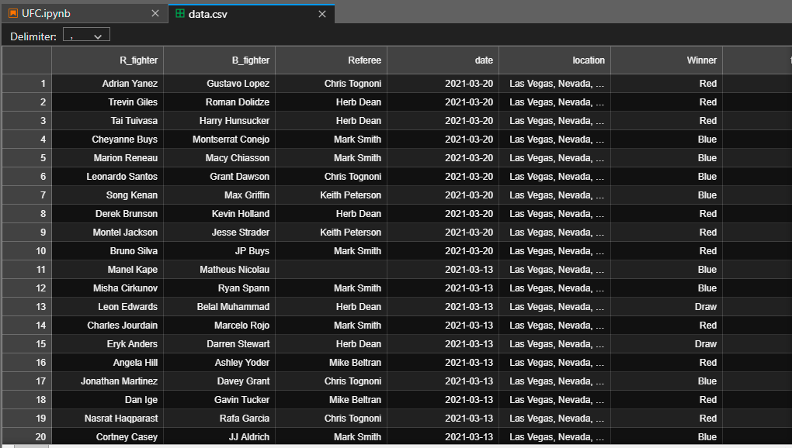
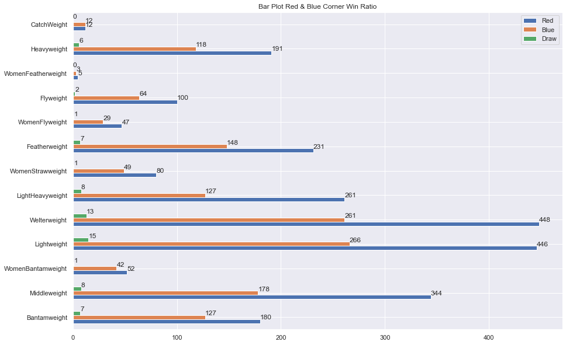
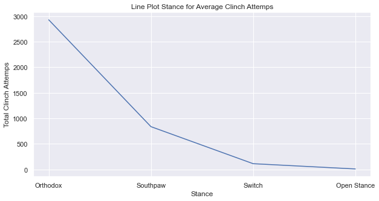

# UFC Match Analysis Match analysis in UFC historical dataset with EDA.

>Martial art is a form of sport that is common in society. Over time, martial arts have many branches. They are starting from Boxing, Wrestling, Silat, and many more.

>Mixed Martial Art (MMA) is a branch of professional martial arts consisting of various martial arts.

>Based on the data obtained, I will present some suggestions for gaining victory in mixed martial arts.

Glosarium

* Red / Blue = The starting side of the fighter represented by the gloves or other attributes in the match 
* Fighter Appearance = Number of matches that have been done by individual athletes

Here's a quick look at the dataset I'm using:

  

The libraries used are as follows:
- numpy
- pandas
- matplotlib
- seaborn

The following is a peek at the visualization result of the analysis:

  

  